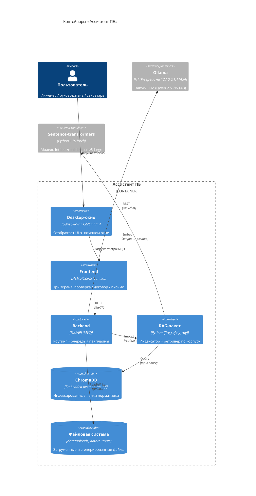

# C4 · Уровень 2. Контейнеры

Показывает основные компоненты (контейнеры) системы «Ассистент ПБ» и как
они общаются.



## Ответственность контейнеров

| Контейнер | Технология | Ответственность |
|---|---|---|
| **Desktop-окно** | pywebview + Chromium/WebKit | Отображает web-UI как нативное окно; запускает backend в фоне |
| **Frontend** | HTML + vanilla JS + CSS | Три экрана: проверка документа, анализ договора, письмо. Отправляет запросы в `/api/*`, опрашивает `/api/tasks/{id}` |
| **Backend** | FastAPI (Python 3.11+) | HTTP-роуты (MVC: `views/`, `controllers/`, `services/`), очередь задач (1 воркер), пайплайны с промптами |
| **RAG-пакет** | ChromaDB + sentence-transformers | Индексация корпуса (batch), top-k поиск по запросу |
| **ChromaDB** | Embedded (файловый) | Векторное хранилище чанков нормативных актов |
| **Ollama** (внешний) | llama.cpp через HTTP | Загрузка LLM в память, инференс, стриминг ответов |

## Слои backend (MVC)

```
apps/backend/src/fire_safety_backend/
├── main.py                 # FastAPI app factory (собирает роутеры)
├── config.py               # env-based настройки
├── models/                 # M — Pydantic-схемы данных
├── views/                  # V — HTTP-роутеры (тонкие)
├── controllers/            # (промежуточный слой оркестрации, зарезервирован)
├── services/               # Бизнес-логика (upload → text)
├── pipelines/              # Пайплайны трёх функций (промпт + LLM + RAG)
├── infrastructure/         # Внешние зависимости
│   ├── llm.py              #   клиент Ollama
│   ├── queue.py            #   in-memory очередь задач
│   ├── parsers/            #   DOCX / PDF / OCR
│   └── generators/         #   DOCX-генератор писем
└── resources/              # Промпты и шаблоны, упакованные с приложением
    ├── prompts/
    └── templates/
```

## Границы деплоя

Всё крутится на одном сервере. Backend слушает `127.0.0.1:8000` (или
случайный свободный порт, если 8000 занят). Ollama — на `127.0.0.1:11434`.
Никаких сетевых обращений за пределы `127.0.0.1` не делается — офлайн-режим.
