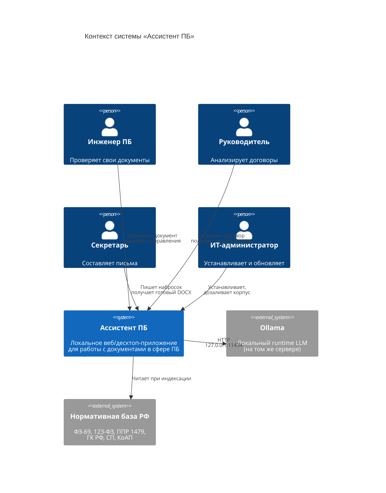

# C4 · Уровень 1. Контекст системы

Показывает, кто и как взаимодействует с системой «Ассистент ПБ».

## Ключевые внешние зависимости

| Система | Роль | Как связано |
|---|---|---|
| **Ollama** | Локальный runtime для LLM (Qwen 2.5 7B/14B) | HTTP на loopback |
| **Нормативная база РФ** | Тексты законов, СП, ГОСТ | Файлы в `packages/rag/corpus/` |
| **Пользователь** | Инженер / руководитель / секретарь / админ | Веб/десктоп-UI |

## Границы

Что **входит** в систему:
- Backend (FastAPI), пайплайны трёх функций.
- RAG-модуль (`packages/rag`) с индексатором и ретривером.
- Frontend + desktop-обёртка pywebview.
- Скрипты установки/сборки.

Что **не входит**:
- Ollama и её модели (внешняя зависимость, устанавливается отдельно).
- OCR-движок Tesseract (внешняя зависимость).
- Тексты законов (поставляются отдельно, могут обновляться).
- 1С, CRM, Active Directory — интеграции запланированы, но не в MVP.
