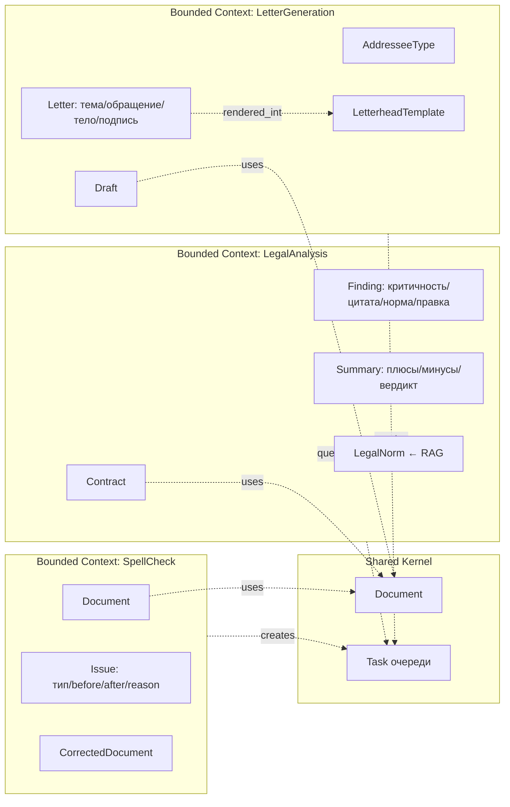

# DDD · Ограниченные контексты

Три пользовательские функции соответствуют трём **Bounded Contexts** —
логическим границам, внутри которых работает своя модель предметной
области.

## Shared Kernel

**`Document`** — общее понятие «входной документ» (текст + метаданные:
исходное имя, формат, размер). Используется всеми тремя контекстами.

**`Task`** — асинхронная задача в очереди. Единый механизм для всех
пайплайнов.

## Bounded Context: SpellCheck

**Язык**: «текст», «фрагмент», «ошибка», «тип ошибки», «исправление».

- **Document** — вход.
- **Issue** — найденная ошибка (`type`, `before`, `after`, `reason`).
- **CorrectedDocument** — вход с применёнными правками.

## Bounded Context: LegalAnalysis

**Язык**: «договор», «сторона», «риск», «критичность», «норма», «правка».

- **Contract** — вход.
- **Finding** — риск в договоре (`критичность`, `цитата_из_договора`,
  `в_чём_риск`, `ссылка_на_норму`, `предложение_правки`).
- **Summary** — вердикт (плюсы, минусы, общий_вывод).
- **LegalNorm** — статья нормативного акта, приходит из RAG.
  *Anti-corruption layer*: RAG отдаёт «сырые» чанки, пайплайн превращает
  их в текстовый контекст промпта — но модель работает уже с текстом.

## Bounded Context: LetterGeneration

**Язык**: «набросок», «адресат», «тон», «письмо», «бланк», «реквизиты».

- **Draft** — набросок пользователя.
- **AddresseeType** — enum (`заказчик`, `МЧС`, `госорган`, `партнёр`,
  `подрядчик`).
- **Letter** — сгенерированное письмо (`тема`, `обращение`, `тело`,
  `формула_вежливости`, плейсхолдеры реквизитов).
- **LetterheadTemplate** — DOCX-шаблон с плейсхолдерами.

## Отношения между контекстами

Все три контекста **независимы друг от друга**. Общий язык — `Document`
и `Task`. RAG-контекст (`packages/rag`) поставляет `LegalNorm` только для
LegalAnalysis, через типизированный API (`retrieve(query) → list[dict]`).

## Границы в коде

| Контекст | Пакет / модули |
|---|---|
| SpellCheck | `pipelines/legacy.py::run_spellcheck` + промпт `resources/prompts/spellcheck.txt` |
| LegalAnalysis | `pipelines/legacy.py::run_legal_analysis` + промпт `resources/prompts/legal.txt` + `packages/rag` |
| LetterGeneration | `pipelines/legacy.py::run_letter` + промпт `resources/prompts/letter.txt` + `infrastructure/generators/letter_docx.py` + `resources/templates/letterhead.docx` |
