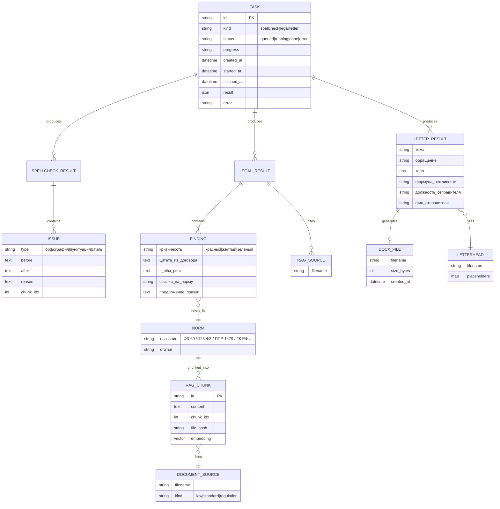

# ER-диаграмма модели данных

**Замечание**: MVP не использует реляционную БД — все объекты живут в
памяти (in-memory очередь задач). Диаграмма показывает **логическую**
модель, которая пригодится при переходе на постоянное хранилище (Sprint 5+).

## Текущая реализация (in-memory)

- **`TASK`** — dict в `TaskQueue._tasks`.
- **`RAG_CHUNK`** — коллекция в ChromaDB.
- **`DOCX_FILE`** — файлы в `data/outputs/`.
- **`ISSUE`, `FINDING`, `LETTER_RESULT`** — Python-словари в `Task.result`.

## Переход на постоянное хранение (после MVP)

Когда появится потребность хранить историю задач между запусками:
- **`TASK`, `ISSUE`, `FINDING`, `LETTER_RESULT`** → PostgreSQL/SQLite (via SQLAlchemy).
- **`DOCX_FILE`** → S3-совместимое хранилище (MinIO локально).
- **`RAG_CHUNK`** → остаётся в ChromaDB (можно перейти на Qdrant для кластера).
